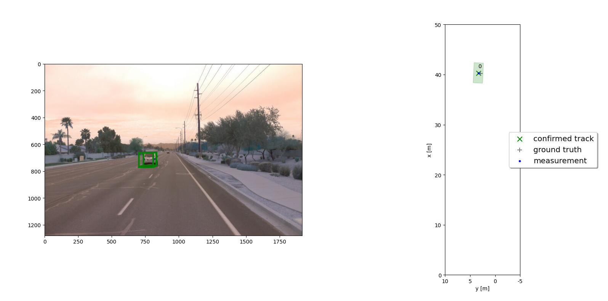
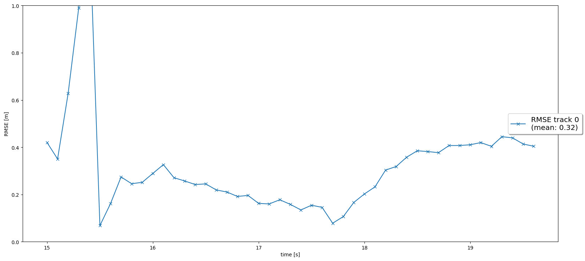
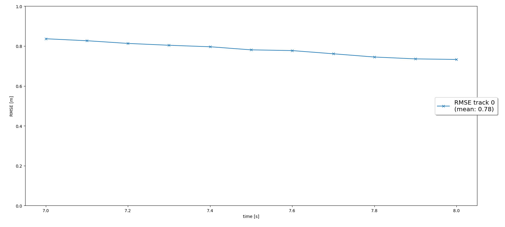
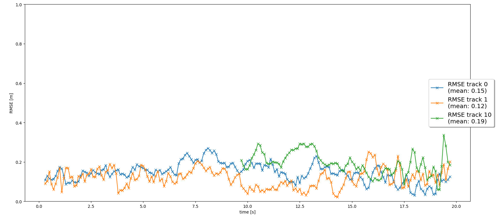
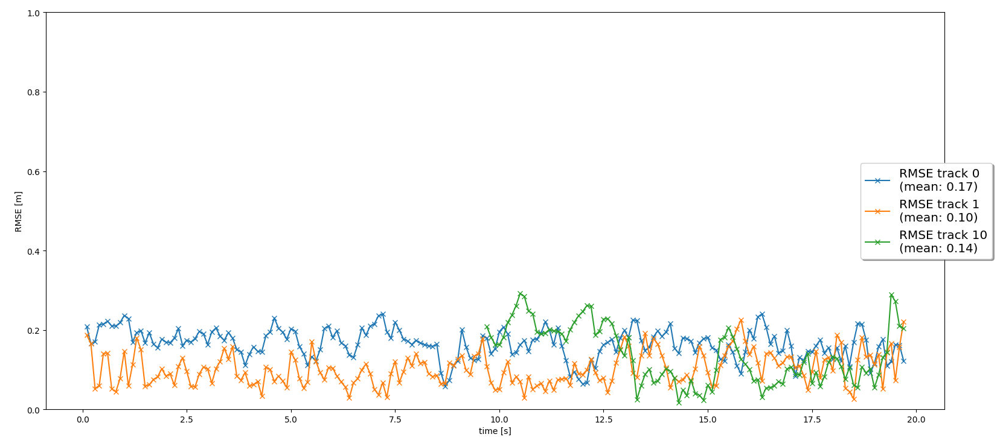

# Writeup: Track 3D-Objects Over Time

In this lesson, I learn knowledge of Kalman Filter, Extended KF, fusion and tracking methods.

## Step 1 : Tracking - Track objects over time with a Kalman Filter

## Step 2 : Track Management - Initialize, update and delete tracks

## Step 3 : Data Association - Associate measurements to tracks with nearest neighbor association

## Step 4 : Sensor Fusion - Fuse measurements from lidar and camera

### 1. Write a short recap of the four tracking steps and what you implemented there (filter, track management, association, camera fusion). Which results did you achieve? Which part of the project was most difficult for you to complete, and why?

**Filter**:  
Predict state vector and state covariance matrix for each track

- Initialized with process noise covariance matrix Q and model matrix F
- Takes raw sensor data, state measurement H(x), sensor matrix H from measurement
- Takes state X and state covariance matrix P from track object
- Update state X and state covariance matrix P in track object

**Track management**:  
Manage track list by updating old tracks, creating new tracks, or deleting ghost and old tracks.  
- Initialized with empty track list, last id = -1, number of tracks = 0, and  
- Contain track object first Initialized with prior state X (taken from measurement), prior covariance matrix P, track score, track state and other track attributes  
- Take unassigned track list from association and drop the score of unassigned track  
- Loop through all tracks in the track list and based on track state, track covariance matrix P and track score to decide if the track needs to be deleted  
- Create new tracks based on unassigned measurement list which are not associated to any old tracks  

**Association**:  
Match sensor measurement to corresponding track. Then, update unassigned track list and unassigned measurement list  
- Initialized with empty unassigned track list, unassigned measurement list and empty association matrix.  
- Take track list from track management and sensor measurement. Then, associate each track to corresponding measurement and update unassigned track list and unassigned measurement list.  

**Camera fusion**:  
Use camera measurement to update state X and state covariance matrix P

**Results achieved**:  
Can run multiple objects detection and tracking by using both camera and lidar measurements. 

### 2. Do you see any benefits in camera-lidar fusion compared to lidar-only tracking (in theory and in your concrete results)? 
Yes, camera-lidar fusion benefits the result. The first picture below is lidar-only detection. The second picture is camera-lidar fusion detection. We can find that tracks in second picture all have slightly lower RMS error.  

  

### 3. Which challenges will a sensor fusion system face in real-life scenarios? Did you see any of these challenges in the project?

In real-life scenarios:  
- Sensor performance could be heavily affected by working environments. For example, rain, heavy fog.
- Sensor position may be changed from its original position which affects sensor to vehicle coordinates translation.
- More vehicles may in the lanes

### 4. Can you think of ways to improve your tracking results in the future?

- Fine-tune parameters such as process noise Q, measurement noise R, initial setting for estimation error covariance P.  
- Increase frame rate to reduce uncertainty in estimation.
